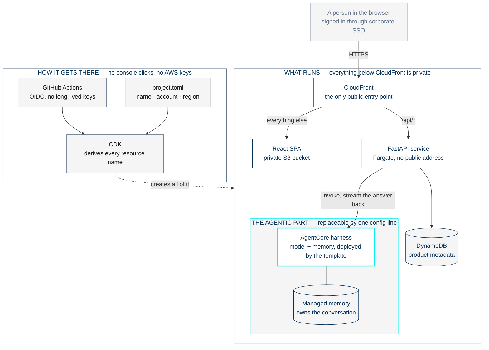

# AWS Fullstack Template — Proposal Overview

A one-page summary of [BLEND360/blendx-core#1144](https://github.com/BLEND360/blendx-core/issues/1144).
For the full detail, see [01-technical-proposal.md](01-technical-proposal.md).

Status: draft for review · Date: September 2026

---

## The problem

A team starting a new AWS app at Blend spends its first weeks on work that has
nothing to do with the product: private ingress, IAM, container builds, keyless
CI/CD, SSO, and — for anything with an agent in it — streaming a harness
response to a browser without leaking infrastructure to the client.

Every team solves it again, slightly differently. The Snowflake vertical already
has a template for this. The AWS vertical does not.

## The proposal

Build `blendx-fullstack-aws-template`: one repository a team clones to get a
deployed, authenticated fullstack application whose business logic already calls
an AgentCore harness.

Clone it, set four values in one file, push. The result is a running app on a
private AWS topology with an agent responding — on day one, with no prior AWS
setup and no "first, go get a harness" step.

## What the team gets

| | |
|---|---|
| Application | React SPA, FastAPI backend, DynamoDB — working, deployable, with a worked example of every layer |
| Agent integration | The part worth extracting from the MVP: invoke a harness, stream the answer as SSE, dispatch tools, never let an AWS error message reach the browser |
| A starter harness | A model plus managed memory, deployed by the template the same way the platform deploys its own. Point at an existing harness instead by changing two values — its ARN and which alias to call |
| Infrastructure | CDK for everything: network, identity, data, compute, CDN |
| CI/CD | GitHub Actions with OIDC. No long-lived AWS keys anywhere |
| One-command setup | A script renames every resource to the team's project, then deletes itself |

## What gets deployed



One public surface, and one place where names are written. Those two properties
are what the rest of the architecture is arranged to protect.

The harness follows the platform's own model — immutable versions, aliases for
environments, deployed with the `agentcore` CLI — so a template-born harness can
graduate into the Hub later without being rebuilt. See
[01-technical-proposal.md §2.4](01-technical-proposal.md).

The same diagram as a Lucidchart-importable source is
[diagrams/00-overview.mmd](diagrams/00-overview.mmd); the component-level views
are in [04-diagrams.md](04-diagrams.md).

## What it looks like

Backend and frontend sit at the top level, each holding one folder per service
or app. The template ships one of each; a team adds siblings as the product
grows, and responsibilities stay separated by folder instead of by convention.

```
blendx-fullstack-aws-template/
├── project.toml          # the only place names, account, and region are written
├── backend/
│   └── api/              # FastAPI service — add sibling services here
├── frontend/
│   └── web/              # Vite + React SPA — add sibling UIs here
├── harness/              # the starter harness: model + managed memory
├── infra/                # CDK (Python), one app
├── scripts/              # setup and one-time account bootstrap
└── .github/workflows/    # ci, deploy
```

One repository, not two. In the MVP the backend's stack creates the frontend's
bucket and CDN, and the frontend cannot deploy without it — a dependency that is
invisible from either side. It is real, so it should be visible. Independent
deploys are preserved through path filters, not repository boundaries.

## How a team adopts it

```
1  create the repo from the template
2  edit project.toml            # name, account, region
3  python scripts/setup.py      # renames everything, then self-deletes
4  python scripts/bootstrap.py  # once per AWS account
5  git push                     # full deploy, agent included
```

## What v1 does not include

Deliberate exclusions, each a candidate follow-up rather than an oversight:

- The rest of the AgentCore surface — gateways, MCP tool runtimes, knowledge
  bases, evaluations, schedulers. The starter harness has a model and memory,
  nothing else.
- Relational databases. DynamoDB only.
- Custom domains, WAF, autoscaling.

The line is drawn where the cost stops being scaffolding. A harness definition
is eight lines of JSON, so it ships. The surface around it is six CDK stacks and
five workflows, so it waits.

## What still needs a decision

| Question | Why it matters |
|---|---|
| Does the template create a VPC or expect one? | A team with no VPC cannot deploy today. This one blocks the adoption guide |
| Is SAML federation on by default? | Most Blend projects federate to a corporate IdP; some have none |
| How do teams get fixes after cloning? | A GitHub template repo gives no upgrade path |

---

Detail lives in the companion documents: [01-technical-proposal.md](01-technical-proposal.md)
for the decisions and their rationale, [02-architecture-model.md](02-architecture-model.md)
for the architecture, [03-subtickets.md](03-subtickets.md) for the work breakdown,
[04-diagrams.md](04-diagrams.md) for the diagrams, and
[05-architecture-standard.md](05-architecture-standard.md) for the pattern the
template follows and the rules a consuming team inherits.
