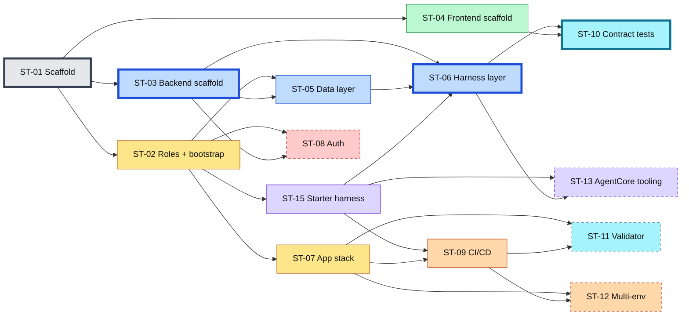

# AWS Fullstack Template — Sub-ticket Breakdown

Planning deliverable for [BLEND360/blendx-core#1144](https://github.com/BLEND360/blendx-core/issues/1144),
acceptance criteria 3 and 4: "Plan broken into scoped sub-tickets per
functionality" and "Sub-tickets filed in `blendx-core`, linked back to this
issue".

Companion documents:
- [00-proposal-overview.md](00-proposal-overview.md) — the one-page summary
- [01-technical-proposal.md](01-technical-proposal.md) — scope, decisions, and approach
- [02-architecture-model.md](02-architecture-model.md) — the architecture model
- [05-architecture-standard.md](05-architecture-standard.md) — the pattern and the rules ST-03 and ST-06 enforce

Each entry below is written in the format of the parent issue and is ready to
file as-is. Every body should close with `Parent: BLEND360/blendx-core#1144`.

Status: draft for review · Date: September 2026

---

## Overview

Fifteen sub-tickets. Eleven are in the parent issue's literal scope; four are
extensions recommended but deferrable without blocking a working template.

| ID | Title | Scope | Size | Hours | Range | Confidence | Depends on |
|---|---|---|---|---|---|---|---|
| ST-01 | Repository scaffold and parametrization | Core | M | 4 | 3–6 | High | — |
| ST-02 | IaC foundation: roles stack and account bootstrap | Core | M | 5 | 4–8 | Medium | ST-01 |
| ST-03 | Backend scaffold | Core | M | 5 | 4–7 | High | ST-01 |
| ST-04 | Frontend scaffold | Core | M | 5 | 4–7 | High | ST-01 |
| ST-05 | Data layer: DynamoDB provisioning and repositories | Core | S | 3 | 2–4 | High | ST-02, ST-03 |
| ST-06 | Harness integration layer | Core | L | 10 | 8–16 | Medium | ST-03, ST-05, ST-15 |
| ST-07 | Application stack: Fargate, ALB, S3, CloudFront | Core | L | 8 | 6–14 | Medium | ST-02 |
| ST-08 | Authentication: Cognito in IaC with optional SAML | Extension | M | 6 | 4–10 | Medium | ST-02, ST-03 |
| ST-09 | CI/CD pipeline | Core | M | 5 | 4–8 | Medium | ST-02, ST-07, ST-15 |
| ST-10 | Streaming contract conformance tests | Core | S | 2 | 1–3 | High | ST-06, ST-04 |
| ST-11 | Deployment validator | Extension | S | 3 | 2–5 | High | ST-07, ST-09 |
| ST-12 | Multi-environment support | Extension | S | 2 | 2–4 | Medium | ST-07, ST-09 |
| ST-13 | Optional AgentCore tooling module | Extension | L | 6 | 6–20 | Low | ST-06, ST-15 |
| ST-14 | Adoption guide and reference documentation | Core | S | 2 | 2–4 | Medium | all core |
| ST-15 | Starter harness | Core | M | 4 | 3–7 | Medium | ST-02 |

| Subtotal | Hours | Range |
|---|---|---|
| Core (11 tickets) | 53 | 41–84 |
| Extensions (4 tickets) | 17 | 14–39 |
| **Total** | **70** | **55–123** |

Sizes are relative shape only: S ≈ a morning, M ≈ a day, L ≈ two days,
XL ≈ does not fit a sprint. The hours are the commitment, not the letter.

### Estimation basis

One engineer, two two-week sprints: Sprint 1 and Sprint 2 of this plan
(Sprint 25 and Sprint 26 on the board). Capacity is twenty working days at
eight hours, so 160 hours gross against 70 committed. Ticket work is planned at
about three and a half hours a day. The rest of the time is buffer, and that is
deliberate: if every ticket lands at the top of its range, 123 hours, the plan
still fits. The buffer covers deploy waits, reviews, the open decisions and
whatever goes wrong, so a bad day moves a bar without breaking the plan.

The point estimates rest on four assumptions. A single-sprint plan only worked
if all four held. With two sprints, a broken assumption pushes the affected
tickets toward their upper bound, and the buffer absorbs it:

1. **This is extraction, not design.** `blendx-aws-mvp-be` and the MVP frontend
   already contain a working version of almost every ticket. The work is
   lifting code that runs today, deleting the product domain, and moving
   literals into `project.toml` — not authoring from a blank file.
2. **Implementation is AI-assisted.** The hours assume generation against the
   named reference files plus review, not hand-typing. Review is the engineer's
   time; typing is not.
3. **Deploy latency overlaps with authoring.** CloudFront and ECS changes take
   minutes to propagate; the next ticket is written while they do. A serialized
   deploy-wait-verify loop pushes ST-07 and ST-09 to their upper bounds on its
   own.
4. **Tests are exactly the ones the acceptance criteria name.** Nothing extra.

Excluded: product discovery, the review latency of other people, obtaining an
AWS account or IdP metadata, and any incident on a shared environment.

Confidence reads as: **High** — a working version exists in the MVP and the
work is extraction; **Medium** — the shape is known but at least one decision
is open; **Low** — deploy-time behavior has to be discovered, where the upper
bound is the real number.

Tickets over five hours carry a subtask table. Those subtasks are the intended
commit boundaries, so each should be independently mergeable. ST-06 and ST-07
carry theirs as real GitHub sub-issues, since both span several days and their
progress is worth tracking per commit; ST-08 and ST-13 keep theirs as a table in
the body, which is enough for a ticket that fits inside a day.

### Sprint plan

Dependency shape. Color is the track; thick border is the critical path;
dashed border is an extension. ST-14 depends on every core ticket and is left
off for readability.

Timeline by track, with status and a today marker:
[sprint-timeline.html](sprint-timeline.html). Open it in a browser. Ticket
status is kept in the `TICKETS` list inside that file.

| Sprint | Days | Focus | Tickets | Hours |
|---|---|---|---|---|
| 1 | 1–4 | Foundation | ST-01, ST-02, ST-15 | 13 |
| 1 | 4–7 | Apps and data | ST-03, ST-04, ST-05 | 13 |
| 1 | 8–10 | Harness layer | ST-06 | 10 |
| 2 | 11–16 | Deploy and auth | ST-10, ST-07, ST-09, ST-08 | 21 |
| 2 | 17–20 | Hardening and extensions | ST-14, ST-11, ST-13, ST-12 | 13 |

| Sprint | Committed | Gross capacity | Ends with |
|---|---|---|---|
| 1 | 36h | 80h | Backend, frontend and harness layer running locally against the starter harness; the test suite passes with no AWS credentials |
| 2 | 34h | 80h | The template deployed, authenticated and streaming through CloudFront, then hardened |

The critical path is ST-01 → ST-03 → ST-06 → ST-10, 21 hours. At the planned
pace it takes about six working days. Everything else is scheduled around it.
ST-15 is early on purpose: it gives ST-06 a real harness to invoke instead of a
stub. ST-06.7, the fake and its recorded fixture, is early for the same reason:
it lets the rest be built without an account. ST-10 opens Sprint 2 so the
contract is pinned while ST-06 is fresh, before any infrastructure work.

The sprint boundary follows the architecture. Sprint 1 is everything that runs
on a laptop. Sprint 2 is everything that needs a deployed account.

**The cut line.** At point estimates nothing has to be cut: 70 hours against
160. The cut line only applies if work runs toward its upper bounds and uses up
the buffer. In that case, drop in this order: ST-12, then ST-13 beyond its
pattern subtask, then ST-11. All three are extensions. Core is not negotiable:
cutting core means the template does not run end to end, and running end to end
is the whole deliverable.

**Stretch, not commitment.** Three items stay out of the committed plan. If
Sprint 2 reaches day 17 with its buffer intact, they are the first candidates
to pull in:
- real SAML federation (ST-08.4, +4h)
- the knowledge base (ST-13.4, ~6h)
- scheduled invocation (ST-13.5, ~4h)

Each depends on something outside the team's control or only discovered at
deploy time, which is why none of them is committed.

The demonstrable milestone lands around day 16: a deployed, authenticated
application streaming a response from its own harness through CloudFront. Days
17–20 harden it.

---

## ST-01 — Repository scaffold and parametrization

Scope: core · Size: M · Estimate: 4h (3–6) · Confidence: high · Depends on: —

### Description
Create the `blendx-fullstack-aws-template` monorepo skeleton, the single
parameter source that every layer derives its names from, and the one-time setup
script that turns a clone into a named project.

### Context
The MVP splits the application across two repositories whose coupling is
invisible: the backend's stack creates the frontend's bucket and distribution,
and the frontend's workflow reads those names from the backend's CloudFormation
outputs. The MVP also repeats the same literal values — project name, table
names, model allowlist — in several files, each carrying a comment warning that
they must agree. This ticket establishes the structure that prevents both.

### Acceptance Criteria
- [ ] Monorepo layout created per `01-technical-proposal.md` §3: `backend/api`, `frontend/web`, `infra`, `scripts`, `.github/workflows`, `docs` — `backend/` and `frontend/` hold one folder per deployable unit, so a second service is a sibling folder and not a reorganization
- [ ] `project.toml` defines project name, AWS account, region, GitHub org, harness ARN and endpoint, model allowlist, and per-environment sizing
- [ ] `infra/config.py` reads `project.toml` and derives every resource name; no resource name is written literally in a stack
- [ ] `scripts/setup.py` applies the parameters, writes `backend/api/.env` and `frontend/web/.env`, and removes itself on success
- [ ] Running `setup.py` twice is safe and reports that setup is already complete
- [ ] A test asserts no hardcoded project name remains outside `project.toml`

### Technical Notes
Mirrors the role `scripts/setup.sh` plays in `blendx-fullstack-app-template`,
adapted to AWS resource naming. Path filters in the workflows (ST-09) preserve
independent deploys per app, so the monorepo does not force a full redeploy on
every change.

---

## ST-02 — IaC foundation: roles stack and account bootstrap

Scope: core · Size: M · Estimate: 5h (4–8) · Confidence: medium · Depends on: ST-01

### Description
Stand up the CDK application, the declarative resource-spec pattern, the IAM
roles stack, and the one-time bootstrap script that resolves the ordering
problem between CI and the role CI needs to assume.

### Context
The GitHub OIDC deploy role is created by the same CDK app that requires that
role in order to run, so the first deploy has nothing to assume. The MVP
documents the answer in prose — "an engineer runs `cdk deploy` locally once."
A template needs it to be a command.

### Acceptance Criteria
- [ ] CDK app with `specs/` dataclasses and `definitions/` data modules; a generic stack iterates the specs
- [ ] `RolesStack` provisions the GitHub OIDC deploy role, the ECS task role, and the ECS execution role
- [ ] The OIDC trust policy handles this org's subject-claim customization, which injects repository and owner ids into `sub`
- [ ] `scripts/bootstrap.py` runs `cdk bootstrap`, creates the OIDC provider if absent, deploys `RolesStack`, and prints the GitHub repository variables to set
- [ ] `bootstrap.py` is idempotent and safe to re-run
- [ ] Adding a role requires only a new entry in `definitions/roles.py`
- [ ] Unit tests assert each role's trust policy and the actions it grants

### Technical Notes
The trust-policy detail is not optional: a naive wildcard on `sub` fails with
"Not authorized to perform sts:AssumeRoleWithWebIdentity" in this org. IAM also
requires a `sub` or `job_workflow_ref` condition on any GitHub OIDC trust
policy, so both `repository` and `sub` conditions are kept.

---

## ST-03 — Backend scaffold

Scope: core · Size: M · Estimate: 5h (4–7) · Confidence: high · Depends on: ST-01

### Description
The FastAPI service: layering, typed configuration, structured logging with
request correlation, the error taxonomy and its single response shape, and the
health and readiness endpoints.

### Context
Every AWS app rebuilds this layer. The MVP's version is complete and generic
once the product domain is removed, so this ticket is an extraction rather than
a design exercise.

### Acceptance Criteria
- [ ] `backend/api` runs locally with `uv sync` and a documented single command
- [ ] Layering enforced: `routers` → `services` → `repositories`/`clients`, by an `import-linter` layers contract run in CI — not a hand-written test. See `05-architecture-standard.md` §5.2
- [ ] Every outbound dependency is reached through a declared `Protocol` port, so a service composes interfaces rather than concrete adapters
- [ ] Typed settings validated at import; a missing required variable fails at startup with a named error, not at first request
- [ ] Structured JSON logging; every line carries the request id, including lines written from a worker thread
- [ ] `X-Request-Id` accepted inbound or generated, returned on every response, and listed in `expose_headers`
- [ ] Error taxonomy implemented per `02-architecture-model.md` §4.3; no upstream message text reaches a response
- [ ] CORS registered outermost so its headers are present on error responses
- [ ] `GET /health` and `GET /ready` implemented, with `/ready` reporting reachability of the harness and the tables
- [ ] Multi-stage Dockerfile, non-root user, no build tooling in the final image
- [ ] Local auth bypass flag, ignored when the process detects it is a deployed task

### Technical Notes
CORS middleware order is load-bearing: Starlette applies middleware in reverse
registration order, so registering CORS last puts it outermost and attaches its
headers to error responses. Without this a 500 reaches the browser as an opaque
CORS failure. The MVP's multi-stage Dockerfile is a gap — its current image
installs pip and uv into the runtime layer.

---

## ST-04 — Frontend scaffold

Scope: core · Size: M · Estimate: 5h (4–7) · Confidence: high · Depends on: ST-01

### Description
The Vite and React SPA: routing, the Blend Design System theme isolated for
swapping, the typed API client, the auth provider and route guard, and the dev
proxy that makes local routing match production.

### Context
The MVP's SPA points at `http://localhost:8000` in development, which forces a
CORS allowlist to exist and be maintained. Routing through a dev proxy instead
makes development and production identical and removes API base URL handling
from the template.

### Acceptance Criteria
- [ ] `frontend/web` runs locally with `npm install` and `npm run dev`
- [ ] `vite.config.ts` proxies `/api` and `/auth` to the local API; no `VITE_API_BASE_URL` exists anywhere
- [ ] Typed `apiFetch` wrapper attaches the app JWT and surfaces the response error shape from ST-03
- [ ] Auth provider with PKCE sign-in, session rehydration, and a route guard
- [ ] Blend Design System theme confined to `src/tokens/` so it can be replaced
- [ ] Client configuration read from `GET /api/v1/configuration`; no duplicated constants such as a model list
- [ ] One example page demonstrating a list, a create, and an error state
- [ ] Vitest set up with at least one component test and one API-client test

### Technical Notes
The SPA takes build-time variables only for what the bundle needs to boot — the
Cognito authority. Everything else arrives at runtime from the configuration
endpoint, so it cannot drift from the backend.

---

## ST-05 — Data layer: DynamoDB provisioning and repositories

Scope: core · Size: S · Estimate: 3h (2–4) · Confidence: high · Depends on: ST-02, ST-03

### Description
The `DataStack` provisioning the sessions table and one example domain table,
plus the repository modules that access them and the ownership model the keys
enforce.

### Context
Decision recorded in `01-technical-proposal.md` §2.2: DynamoDB is the default,
with no relational option in v1. Tables live in their own stack so an
application rollback cannot reach user data.

### Acceptance Criteria
- [ ] `DataStack` provisions `{project}-sessions` and `{project}-items`, both keyed `owner_id` + sort key
- [ ] Tables use on-demand billing and retain-on-delete
- [ ] `TableSpec` dataclass plus a definitions module; adding a table is one entry
- [ ] Repository modules for both tables, with optimistic concurrency on update via a `revision` condition
- [ ] Ownership enforced by the partition key, not by a post-query filter
- [ ] A missing resource and a foreign resource both return 404, asserted by tests
- [ ] The sessions table stores no conversation content, asserted by a schema test
- [ ] Task role grants scoped to these two table ARNs only

### Technical Notes
Table names are passed to the app stack as plain strings derived from
`project.toml`, not as CDK cross-stack references. A cross-stack reference
creates a CloudFormation export, and an export in use cannot be deleted — which
makes deploy order rigid and produces rollbacks reporting "cannot delete export
as it is in use". The MVP works around this in code; the template avoids it.

---

## ST-06 — Harness integration layer

Scope: core · Size: L · Estimate: 10h (8–16) · Confidence: medium · Depends on: ST-03, ST-05, ST-15

### Description
The layer the template exists to provide: how custom business logic invokes an
AgentCore harness and streams the result to a browser. Covers the client, the
runtime-configuration resolver, the inline tool registry, the SSE emitter, and
the error classification for harness and memory failures.

### Context
This is the core deliverable of the parent issue. Per
`01-technical-proposal.md` §2.1 and §2.4, this layer resolves a harness ARN and
an endpoint name from configuration and nothing more — it must work identically
against the starter harness from ST-15 and against a fully tooled platform
harness supplied by a consumer.
In the MVP the equivalent functionality is roughly 1,200 lines across four
files, so this is the largest single piece of core work.

### Subtasks

| # | Subtask | Hours | Notes |
|---|---|---|---|
| ST-06.7 | `HarnessPort` protocol, fake implementation, recorded stream fixture; suite passes with no AWS credentials | 1 | Do this first despite the number: it unblocks everything below and ST-10 |
| ST-06.1 | Harness client: invoke by *(ARN, endpoint)*, bridge the blocking SDK iterator to an async generator, re-bind the request id inside the worker thread, bound the stream with a read timeout | 2 | Port of `app/clients/harness_client.py`. The thread bridge is the one part not worth compressing |
| ST-06.2 | Runtime configuration resolver: merge defaults with session overrides, validate the model against the allowlist, freeze the snapshot, define omitted-versus-`null` semantics | 1.5 | Pure logic, fully unit-testable, no AWS |
| ST-06.3 | SSE emitter and chunk vocabulary per `02-architecture-model.md` §6.2, with sentinel filtering under lookbehind and a terminal `error` chunk | 2 | A sentinel split across two chunks is the hard case and the reason this is not 1h |
| ST-06.4 | Inline tool registry, dispatch table, and one worked example tool; an unknown or failing tool becomes a tool result | 1 | |
| ST-06.5 | Conversation history read from harness memory by paging events after metadata authorization | 1 | Paging behavior is only observable against a real harness; may overrun |
| ST-06.6 | AWS error classification into the taxonomy, plus wiring the session create, stream, history, and delete endpoints | 1 | |
| ST-06.8 | Integration guide: adding a tool, adding a chunk type, what never crosses the client boundary | 0.5 | |

Listed in execution order, not numeric order. The 16-hour upper bound is driven
by ST-06.1 and ST-06.5: both depend on observed AgentCore streaming and memory
behavior rather than on documented contracts, and neither is something the MVP
answers by reading it.

### Acceptance Criteria
- [ ] `app/harness/client.py` invokes a harness by its resolved *(ARN, endpoint)* pair and yields a stream; the blocking SDK iterator is bridged to an async generator with the request id re-bound inside the worker thread
- [ ] A read timeout bounds the stream, with a value and a comment distinguishing a slow turn from a wedged one
- [ ] `app/harness/runtime.py` merges configuration defaults with session overrides, validates the model against the allowlist (422 on miss), resolves ids to executable references, and freezes the snapshot before first use
- [ ] An omitted override preserves the current value; an explicit `null` restores the frozen default
- [ ] `app/tools/` provides a registry and dispatch table plus one worked example tool with a test
- [ ] An unknown or failing tool becomes a tool result reported to the model, not an exception that ends the turn
- [ ] `app/harness/streaming.py` emits exactly the chunk vocabulary in `02-architecture-model.md` §6.2
- [ ] A mid-stream failure arrives as a terminal `error` chunk carrying code, retryable, and requestId
- [ ] Conversation history is read from harness memory by paging events, after metadata authorization
- [ ] AWS errors are classified into the taxonomy; no upstream text is returned
- [ ] Session creation, message streaming, history, and deletion endpoints wired end to end
- [ ] The layer reads the harness ARN and endpoint from configuration only; a test asserts nothing imports from the harness subproject or assumes a tooled harness
- [ ] `app/harness/port.py` declares the `HarnessPort` protocol, and a fake implementation replays a recorded stream fixture covering deltas, a tool call, and an error chunk
- [ ] The backend test suite passes with no AWS credentials present — the fake for the harness, `moto` for the tables
- [ ] A written guide covering how to add a tool, how to add a chunk type, and what never crosses the client boundary

### Technical Notes
The browser sends only message text and ids. The backend resolves ids to
executable references and never accepts an ARN, a memory coordinate, an actor
id, or a skill URI as input. Text deltas need protocol-sentinel filtering with
lookbehind, since a sentinel can arrive split across two chunks. Reference
implementation: `blendx-aws-mvp-be` `app/clients/harness_client.py`,
`app/services/chat_service.py`, `app/services/session_runtime_service.py`,
`app/tools/harness.py`.

---

## ST-07 — Application stack: Fargate, ALB, S3, CloudFront

Scope: core · Size: L · Estimate: 8h (6–14) · Confidence: medium · Depends on: ST-02

### Description
The runtime infrastructure: network, ECS cluster and Fargate service, internal
ALB, private S3 bucket for the SPA, and the CloudFront distribution that is the
single public entry point.

### Context
This reproduces the MVP's proven topology from the pattern rather than from the
file. The MVP's stack pins every logical id and deletes properties from the
rendered template, all of it because that stack was migrated onto a live
CloudFormation stack. A greenfield template must not inherit those constructs —
see `01-technical-proposal.md` §8.

### Subtasks

| # | Subtask | Hours | Notes |
|---|---|---|---|
| ST-07.1 | Network and compute: minimal VPC by default with an import-by-id override, ECS cluster, Fargate service with ECS Exec, health-check grace period, rolling deployment bounds | 2 | Blocked on open decision 2, create versus import a VPC. Resolve it before Sprint 2 starts |
| ST-07.2 | Internal ALB, both security groups, CloudFront origin prefix-list ingress, egress left undeclared | 1.5 | |
| ST-07.3 | Private S3 bucket: public access blocked, bucket-owner-enforced ownership, origin access control | 0.5 | |
| ST-07.4 | CloudFront distribution: cached SPA default behavior, uncached VPC-origin behaviors for `/api/*`, `/auth/*`, `/health`, 403 and 404 rewritten to `/index.html` | 2.5 | Mostly waiting on propagation, not authoring |
| ST-07.5 | App JWT signing secret in Secrets Manager injected by ECS, `CORS_ORIGINS` derived from the distribution domain, startup failure on empty or wildcard | 0.5 | |
| ST-07.6 | Stack outputs plus unit tests: ALB internal, bucket private, every API path has a behavior on the API origin | 1 | The behavior-coverage test is the one that catches a 200-carrying-HTML failure |

These hours are authoring and review only. They hold exactly as long as
assumption 3 in the estimation basis holds — deploy cycles overlapped with the
next piece of work. A serialized deploy-wait-verify loop puts this ticket at
its 14-hour bound by itself. The Sprint 2 buffer covers that, but it is the
most likely place for the buffer to go.

### Acceptance Criteria
- [ ] A minimal VPC is created by default; an override in `project.toml` imports an existing VPC and subnets by id
- [ ] ALB is internal, ingress restricted to the CloudFront origin prefix list on port 80
- [ ] Task security group accepts port 8000 from the ALB security group only
- [ ] Egress is not declared on either security group
- [ ] Fargate service with ECS Exec enabled, health check grace period set, and rolling deployment bounds configured
- [ ] S3 bucket blocks public access, uses bucket-owner-enforced ownership, and is reachable only through an origin access control
- [ ] CloudFront default behavior serves the SPA cached; `/api/*`, `/auth/*`, and `/health` route to the ALB VPC origin uncached, forwarding the viewer request except Host
- [ ] 403 and 404 from the S3 origin rewrite to `/index.html` with status 200 for client-side routing
- [ ] App JWT signing secret generated by CDK in Secrets Manager and injected by ECS; never an environment variable in the repo
- [ ] `CORS_ORIGINS` derived from the distribution domain; startup fails on an empty value or a wildcard
- [ ] No `override_logical_id` and no property-deletion override anywhere in the stack
- [ ] Stack outputs published for the bucket name, distribution id, and public URL
- [ ] Unit tests assert the ALB is internal, the bucket is private, and every API path has a behavior pointing at the API origin

### Technical Notes
Security group egress is deliberately left undeclared. Declaring it explicitly
means that on any stack rollback, for any reason, CloudFormation deletes the
explicit rule without restoring the implicit default — which removed the live
task's outbound access twice during the MVP's deployment work.

The behavior coverage requirement is not cosmetic: a route with no matching
behavior falls through to the S3 origin, returns 403, is rewritten to
`index.html`, and reaches the client as a 200 carrying HTML where JSON was
expected — a failure that looks like a success.

---

## ST-08 — Authentication: Cognito in IaC with optional SAML

Scope: extension · Size: M · Estimate: 6h (4–10) · Confidence: medium · Depends on: ST-02, ST-03

### Description
`AuthStack` provisioning the Cognito user pool, a public PKCE app client, the
hosted login domain, the access-control group, and the pre-token-generation
Lambda gate — with SAML federation to a corporate IdP behind a flag.

### Context
This is the one MVP component that is not infrastructure as code: its pool and
client were created in the console and their ids are recorded in documentation.
Replicating that by hand in every new project defeats the purpose of a template.
Classified as an extension because a consumer could ship without it, but in
practice every Blend project needs it.

### Subtasks

| # | Subtask | Hours | Notes |
|---|---|---|---|
| ST-08.1 | `AuthStack`: user pool, hosted login domain, access-control group, public PKCE app client with localhost and distribution callbacks | 2 | Porting console-created resources into CDK; expect drift from what the console recorded |
| ST-08.2 | Pre-token-generation Lambda denying issuance outside the access group, with tests | 1 | |
| ST-08.3 | Backend Cognito id-token validation via JWKS — signature, issuer, audience — then app JWT minting | 2 | Includes the recorded decision on the single-gate weakness: re-check the claim or shorten expiry |
| ST-08.4 | SAML flag and code path wired, provider created from a metadata file with claim-to-attribute mapping | 0.5 | Committed scope is the flag off and the path unexercised. Federating against the real IdP is +4h, a stretch item, not committed |
| ST-08.5 | Pool and client ids as stack outputs consumed by the API task and the SPA build; failure-mode tests for wrong audience, wrong issuer, expired, bad signature | 0.5 | |

ST-08.4 is the whole risk and the reason it is scoped to the flag only:
federation depends on an IdP this team does not control, and a sprint cannot
commit to a dependency that arrives by email.

### Acceptance Criteria
- [ ] `AuthStack` provisions the user pool, hosted domain, and access group
- [ ] The app client is public with no secret, authorization code plus PKCE, scopes `openid email profile`; callback and logout URLs include localhost and the distribution domain
- [ ] Pre-token-generation Lambda denies token issuance for users outside the access group
- [ ] SAML identity provider created only when enabled in `project.toml`, from a metadata file path, with claim-to-attribute mapping configured
- [ ] Pool and client ids published as stack outputs and consumed by the API task and the SPA build; never hand-copied
- [ ] Backend validates the Cognito id token via JWKS, checking signature, issuer, and audience, then mints a short-lived app JWT
- [ ] A decision is recorded and implemented for the single-gate weakness: either re-check the group claim on each request or shorten the app JWT expiry
- [ ] Tests cover token validation failure modes: wrong audience, wrong issuer, expired, bad signature

### Technical Notes
The app client must be public. A confidential client causes `invalid_client`
errors on token exchange, because Cognito requires HTTP Basic client
authentication for any client holding a secret, which a browser SPA cannot
safely do. For SAML, prefer the immutable directory object identifier claim over
the application-scoped name identifier when deduplicating users.

---

## ST-09 — CI/CD pipeline

Scope: core · Size: M · Estimate: 5h (4–8) · Confidence: medium · Depends on: ST-02, ST-07

### Description
GitHub Actions workflows: a pull-request check and a single ordered deploy
pipeline from push to smoke test, authenticating to AWS through OIDC with no
stored keys.

### Context
The MVP's deploys were originally independent path-triggered workflows firing in
parallel on the same merge, which let a container image go live before its task
role had the grants it needed. The fix was an explicit ordered chain. The
template starts there.

### Acceptance Criteria
- [ ] `ci.yml` runs on pull requests: API tests, web tests, infra tests, lint, type check, and `cdk diff`
- [ ] `deploy.yml` runs on push to the default branch in one ordered chain: test → roles → auth → data → harness → image build and push → app stack → SPA publish and invalidation → smoke test
- [ ] The harness step runs `agentcore validate` then `agentcore deploy`, reads the new version from the stack outputs, points the configured endpoint at it, and waits for `READY` before continuing
- [ ] The harness step is skipped when `project.toml` names an existing harness ARN, and the app stack receives that ARN and endpoint instead
- [ ] AWS authentication via OIDC only; no secret holds an AWS key
- [ ] ECR repository has immutable tags; image tag is `<sha>-<run_attempt>` so a re-run cannot collide
- [ ] Path filters skip the image build when only `frontend/` changed, and skip the SPA publish when only `backend/` changed
- [ ] A concurrency group prevents two deploys of the same environment overlapping, without cancelling one in flight
- [ ] The smoke test calls the public URL's health endpoint with retry and fails the run on a non-JSON response
- [ ] Stack outputs are read from CloudFormation rather than duplicated as workflow variables

### Technical Notes
Retrying a failed job must produce a fresh image tag, which is why the run
attempt is part of the tag. The smoke test asserts on the response body, not
only the status: a missing CloudFront behavior returns 200 with `index.html`, so
a status-only check passes while the API is unreachable.

---

## ST-10 — Streaming contract conformance tests

Scope: core · Size: S · Estimate: 2h (1–3) · Confidence: high · Depends on: ST-06, ST-04

### Description
Tests on both sides of the SSE contract that pin the chunk vocabulary, so a
change to the backend's emitter or the frontend's reducer cannot silently
diverge.

### Context
The chunk vocabulary is the template's backend-to-frontend interface and the
part a consumer is most likely to extend. Without a pinned contract, an added
chunk type is a frontend bug discovered by a user.

### Acceptance Criteria
- [ ] A shared fixture defines a canonical chunk sequence covering text, a tool call, completion, and a mid-stream error
- [ ] Backend test asserts the emitter produces exactly that sequence for a stubbed harness stream
- [ ] Frontend test asserts the reducer renders that sequence into the expected message state
- [ ] A test asserts an `error` chunk after partial text preserves the partial text
- [ ] Adding a chunk type without updating both sides fails at least one test

### Technical Notes
Keep the fixture in one place both suites read, so the contract has a single
definition rather than two copies that agree today.

---

## ST-11 — Deployment validator

Scope: extension · Size: S · Estimate: 3h (2–5) · Confidence: high · Depends on: ST-07, ST-09

### Description
A read-only validator with two modes: static checks needing no credentials, run
on every pull request, and live checks against deployed AWS state, run after
deploy and on a schedule.

### Context
The MVP's validator is its most differentiated asset and has no equivalent in
the Snowflake template. Its checks catch whole classes of deployment failure
that otherwise present as a working application returning wrong content.

### Acceptance Criteria
- [ ] `--mode static` runs without AWS credentials and verifies: every API route has a CloudFront behavior pointing at the API origin; API behaviors are uncached and HTTPS-only; `CORS_ORIGINS` is the distribution domain and never a wildcard; the ALB is internal; the frontend bucket is private; the ALB health-check path is a route the app serves
- [ ] `--mode live` is strictly read-only and verifies: stacks are in a healthy terminal state; the ECS service has running tasks and its last rollout succeeded; the ALB has a healthy target; the distribution carries the expected behaviors; the health endpoint returns JSON rather than HTML; a CORS preflight allows the SPA origin and does not reflect an arbitrary one
- [ ] `iam:SimulatePrincipalPolicy` confirms the task role can make the calls the code paths make
- [ ] Non-zero exit on any failure, with printed remediation per failure; warnings never fail the run
- [ ] A Markdown report is written to the workflow step summary
- [ ] The static checks also run as unit tests, so the existing test job catches them
- [ ] A test asserts the deploy role's inspection grants remain Describe, Get, List, and Simulate only

### Technical Notes
Generalize the MVP's checks: keep everything about routing, CORS, ingress, and
IAM; drop the AgentCore-specific gateway and knowledge-base checks, which belong
to ST-13.

---

## ST-12 — Multi-environment support

Scope: extension · Size: S · Estimate: 2h (2–4) · Confidence: medium · Depends on: ST-07, ST-09

### Description
Parameterize the CDK application and the deploy pipeline by environment so one
repository can manage `dev`, `staging`, and `prod`.

### Context
The MVP is single-environment, which is right for an MVP and wrong for a
template. Deferring this is acceptable only because the naming discipline from
ST-01 makes it additive rather than a rewrite.

### Acceptance Criteria
- [ ] An `ENV` input selects a section of `project.toml` and suffixes every stack and resource name
- [ ] Sizing, removal policies, and log retention differ by environment; data and auth stacks retain on delete outside `dev`
- [ ] Two environments deploy into the same account without a name collision
- [ ] The deploy pipeline targets one environment per run, with production gated by a GitHub environment approval
- [ ] A test asserts no resource name is unsuffixed
- [ ] The harness is the exception to per-environment naming: one harness resource, one endpoint per environment, and promotion repoints an endpoint at a version already validated in the environment below — it never redeploys

### Technical Notes
Removal policies are the part most easily got wrong: a `dev` teardown should be
clean, and a `prod` teardown should be impossible to do by accident.

The harness does not follow the suffix-every-name rule, and that is deliberate:
`01-technical-proposal.md` §2.4 records the platform's model, where environments
are endpoints on a single harness resource rather than separate stacks. Take the
rule from there rather than reinventing it, and reuse
`blendx-aws-foundry-infra`'s `point-harness-alias.sh` and
`wait-harness-ready.sh`. Rolling a harness back is the same call with an earlier
version number, which is what makes harness rollback fall out of this ticket
nearly for free.

---

## ST-13 — Optional AgentCore tooling module

Scope: extension · Size: L · Estimate: 6h (6–20) · Confidence: low · Depends on: ST-06, ST-15

### Description
An optional module that gives the starter harness tools: gateways fronting tool
runtimes, a managed knowledge base, S3 skills, and scheduled invocation.

### Context
Recorded in `01-technical-proposal.md` §2.1: v1 ships a harness with a model and
managed memory and nothing else, because that part is eight lines of declarative
config, while everything that gives a harness tools is six CDK stacks and five
workflows in the MVP — each with deploy-time context that cannot be authored
before its component exists. This ticket exists so that capability is tracked
rather than lost.

### Subtasks

| # | Subtask | Hours | Notes |
|---|---|---|---|
| ST-13.1 | Module flag in `project.toml` and the deletable-directory boundary; extension points on the ST-15 harness without duplicating its subproject | 1 | Do this first: it is what keeps the rest optional |
| ST-13.2 | Gateway stack pattern — one stack per backing component, deploy-time context resolution, synth skipped with a named-keys error when context is missing | 2.5 | The core of the ticket and the source of the low confidence |
| ST-13.3 | One worked MCP tool runtime with its gateway and its workflow, as the reference a consumer copies | 1.5 | |
| ST-13.6 | Validator extended with the AgentCore checks deferred from ST-11 | 0.5 | |
| ST-13.7 | Per-component deploy order documented: roles, then the component, then its gateway | 0.5 | |

**Not committed.** The managed knowledge base with its S3 data source and
the documented ingestion step (ST-13.4, ~6h) and scheduled invocation via
EventBridge Scheduler and Step Functions (ST-13.5, ~4h) are not committed.
Filing them in the ticket keeps the capability tracked, which is why ST-13
exists at all.

Confidence is low because each subtask carries a value — a runtime ARN, a
gateway ARN with a random suffix — that only exists after its component
deploys, so the pattern in ST-13.2 can only be validated by running it. The
20-hour upper bound is what this becomes if that pattern does not land on the
first component; at that point it leaves the plan, per the cut line.

### Acceptance Criteria
- [ ] Enabled by a flag in `project.toml`; when disabled, the module's directory can be deleted with no effect on the rest of the template
- [ ] Extends the ST-15 harness with tool references in its existing `harness.json`; the harness subproject itself is not duplicated
- [ ] Provisions one gateway per backing component, each in its own stack, deployed by the workflow owning that component
- [ ] A stack whose deploy-time context is missing is skipped at synth with a named-keys error, rather than deploying a gateway with an absent target or deleting a live one
- [ ] Optional managed knowledge base with an S3 data source and documented ingestion as a separate data-plane step — ST-13.4, stretch, not committed
- [ ] Optional scheduled invocation via EventBridge Scheduler and Step Functions — ST-13.5, stretch, not committed
- [ ] Documented deploy order per component: roles, then the component, then its gateway
- [ ] Validator extended with the AgentCore checks deferred from ST-11

### Technical Notes
Neither a runtime ARN nor a knowledge base id can be authored ahead of first
deploy — both are assigned at creation — so each workflow resolves its own value
after deploying the component and passes it as CDK context. A gateway ARN ends
in a random suffix and must be published as a stack output rather than derived
from the gateway name.

---

## ST-14 — Adoption guide and reference documentation

Scope: core · Size: S · Estimate: 2h (2–4) · Confidence: medium · Depends on: all core tickets

### Description
The documentation a team reads to adopt the template: prerequisites, the
five-step adoption flow, the harness integration guide, and the extension points.

### Context
A scaffold nobody can adopt without its authors is not an accelerator. One open
decision blocks writing this: whether the template creates a VPC or imports one
(`01-technical-proposal.md` §11, item 2).

### Acceptance Criteria
- [ ] README covering prerequisites, the adoption flow, and local development for both apps
- [ ] Prerequisites state what an adopter must have (an AWS account, a bootstrapped region) and state that a harness is not among them — the template deploys one
- [ ] Documented path for pointing at an existing harness instead — both values, ARN and endpoint — and what changes when a consumer does
- [ ] Harness integration guide: adding a tool, adding a chunk type, what never crosses the client boundary
- [ ] Extension guide: adding a table, a role, a route, a page
- [ ] The architecture model from `02-architecture-model.md` included, with diagrams
- [ ] An inherited-weaknesses section recording the access-control single gate and anything else knowingly carried forward
- [ ] A first-time adopter reaches a deployed application following only the documentation

### Technical Notes
Resolve open decision 2 from `01-technical-proposal.md` §11 before writing:
whether the template creates a VPC or imports one.

---

## ST-15 — Starter harness

Scope: core · Size: M · Estimate: 4h (3–7) · Confidence: medium · Depends on: ST-02

### Description
A conditional `agentcore` subproject that deploys one minimal AgentCore harness
— a model and managed memory, no tools — so a fresh clone has an agent to talk
to without obtaining one first.

### Context
`01-technical-proposal.md` §2.1 records the measurement behind this ticket: a
harness is a declarative file, and stripped to a model plus managed memory it is
about eight lines. Including one removes the only prerequisite the adoption flow
would otherwise have. Everything that gives a harness tools stays in ST-13.

§2.4 settles the toolchain question this ticket used to leave open. The platform
deploys Harnesses with the `agentcore` CLI over a `@aws/agentcore-cdk` app, in a
fixed layout with fixed naming conventions, and this ticket follows them rather
than expressing the harness in the template's own CDK app. That is what moved
the estimate from 2h to 4h: it is a subproject plus a pipeline step that reads
CloudFormation outputs back, not a conditional stack in an app that already
exists.

### Acceptance Criteria
- [ ] `harness/` follows the platform layout: `agentcore/{agentcore.json, aws-targets.json, cdk/}` plus `app/assistant/harness.json`
- [ ] `harness/app/assistant/harness.json` declares a model from `project.toml`, the execution role from ST-02, and `memory.mode = "managed"`
- [ ] No tools, no skills, no gateway references
- [ ] Names follow the platform convention — stack `AgentCore-<agentcore.json name>-<target>`, outputs `Harness<PascalName>{Id,Arn,Status,Version,AgentRuntimeArn}` — and `setup.py` derives them from `project.toml`
- [ ] Deployment runs `agentcore validate` then `agentcore deploy`, and reads the resulting harness id, ARN, and version back from the stack outputs by substring match
- [ ] The endpoint named by `harness.endpoint` is created on first deploy and repointed on subsequent ones; the app receives the resolved *(ARN, endpoint)* pair
- [ ] Nothing is deployed when `project.toml` supplies a `harness.arn`; the app stack then receives that ARN and endpoint instead
- [ ] Skipping prints which value caused the skip, rather than failing silently or deleting a deployed harness
- [ ] A harness execution role is added to `definitions/roles.py` with only the permissions a model-and-memory harness needs
- [ ] Task role granted invoke permission on the resolved harness ARN, whichever source it came from
- [ ] Unit test asserts the harness is absent when an ARN is configured and present when it is not
- [ ] Deploying twice with no change is a no-op — no new harness version is created

### Technical Notes
Reference implementations, in order of closeness: the platform's
`blendx-aws-foundry-infra` `hub/harnesses/project_assistant/` (the convention
this ticket follows), and `blendx-aws-mvp-be`
`agentcore/project_assistant_harness/` plus
`.github/workflows/agentcore-project-assistant-harness.yml` — the same layout,
already working, with the tools this ticket strips.

Harness versions are immutable and endpoints are the alias primitive, so the
sequence is deploy → read version → point endpoint → wait for `READY`. The
platform ships `point-harness-alias.sh` and `wait-harness-ready.sh` for the last
two steps; reuse them rather than writing equivalents.

Managed memory holds conversation history, so this carries a retain removal
policy outside `dev` — a teardown that drops the harness drops every
conversation with it.

Out of scope: registering the harness in the Hub catalog. See
`01-technical-proposal.md` §2.4 and §11 item 6.

---

## Filing checklist

- [ ] Open decision 2 in `01-technical-proposal.md` §11 resolved before Sprint 2 starts, since ST-07.1 is blocked on it
- [ ] Open decisions 6 and 7 in §11 confirmed with the platform team — they set whether ST-15 follows the Hub's naming convention and whether template-born harnesses register in the catalog
- [ ] Sizes, hours, and the two-sprint plan reviewed with the assignees of #1144
- [ ] Sprint 1 tickets (ST-01–ST-06, ST-15) set to Sprint 25 and Sprint 2 tickets (ST-07–ST-14) to Sprint 26 on the board
- [ ] The four assumptions in the estimation basis confirmed, or the hours renegotiated
- [ ] Subtask checklists copied into the bodies of ST-06, ST-07, ST-08, and ST-13
- [ ] Extensions confirmed as in or out of the first release
- [ ] Each sub-ticket filed in `blendx-core` with `Product = BlendX 2.0` and label `enhancement`
- [ ] Each body closes with `Parent: BLEND360/blendx-core#1144`
- [ ] #1144 updated with the list of filed sub-ticket numbers
